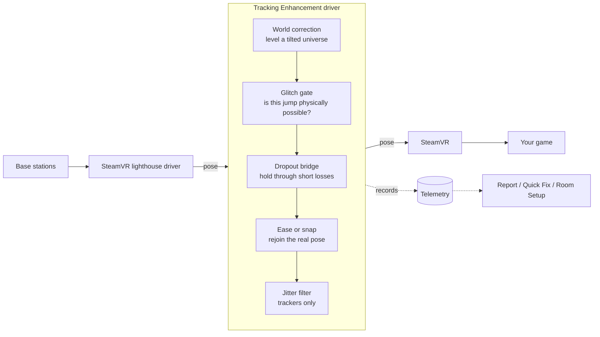

# SteamVR Tracking Enhancement

**Steadier base-station tracking for SteamVR — and a button for when the floor or the world is wrong.**

SteamVR Tracking Enhancement is an add-on for headsets, controllers and trackers that are tracked by
base stations ("lighthouse"). It sits between the tracking driver and SteamVR, catches tracking
glitches before your game sees them, tells you what causes them, and gives you a panel inside VR to
fix a floor that is too high, too low, or tilted.

[](https://github.com/TacticalCoconut/SteamVR-Tracking-Enhancement/actions/workflows/build.yml)
[](LICENSE)

> An independent project: not made, endorsed or supported by Valve. SteamVR is a trademark of Valve
> Corporation, used here only to say what this add-on works with.

---

## What it is

| Part | What it does | Runs |
|---|---|---|
| **Driver** | Filters every tracking pose: rejects reflection glitches, bridges short dropouts, eases corrections in, smooths trackers, levels a tilted world, watches your base stations | inside SteamVR, automatically |
| **Quick Fix** | A dashboard panel: *I'm floating*, *I'm clipping into the floor*, *The world is tilted* — measures the problem and fixes it | when you start it |
| **Room Setup** | An alternative room setup: floor from several points, boundary snapped to your walls | when you start it |
| **Report** | Reads SteamVR's logs and the driver's records, tells you what is wrong with your setup and where in the room | on your desktop |

### Names you will see

The project is called **SteamVR Tracking Enhancement**. Its files, folders and settings carry the
short name `svrenhance`, so that is what to look for on your PC:

| Where | Name |
|---|---|
| SteamVR's add-on list | `svrenhance` |
| The driver | `driver_svrenhance.dll` |
| Settings section in `steamvr.vrsettings` | `driver_svrenhance` |
| Logs and records | `%LOCALAPPDATA%\SVREnhance\` |
| Tools | `svrenhance_fix.exe`, `svrenhance_roomsetup.exe`, `svrenhance.py` |
| SteamVR dashboard tab | **FIX** |

## Who it is for

You will get the most out of it if you use **base stations** and any of these sound familiar:

- **Full-body tracking** — a foot or hip tracker that freezes, flies off or twitches for a moment.
- **A room with mirrors, windows, a TV or a glossy floor** — controllers that jump when you face a
  certain way.
- **A floor that is never quite right** — you hover a few centimetres up, sink into the ground, or
  one side of the room is lower than the other.
- **Tracking that is "mostly fine"** but you cannot tell *what* causes the bad moments.

Headsets and devices it works with: anything SteamVR tracks through lighthouse — Valve Index,
HTC Vive / Vive Pro, Pimax, Bigscreen Beyond, Index and Vive controllers, Vive and Tundra trackers.

It is **not** for you if your headset tracks with cameras (Quest, Pico, Windows Mixed Reality): the
driver leaves those devices untouched. And it cannot repair hardware — a dying base station or a
cracked controller ring still needs replacing, though the report will help you find out which one.

## What it fixes

| You notice | What is happening | What the add-on does |
|---|---|---|
| A controller or tracker jumps for an instant | Laser light bounced off a reflective surface | Holds the jump back. If it is gone within ~50 ms it was a glitch and is dropped |
| A device snaps to a new place | Tracking corrected itself | Small corrections are eased in over 150 ms; large ones (over 50 cm) snap, as before |
| A device flies away or freezes briefly | Its sensors lost sight of the stations | Holds a steady, gently coasting pose for up to 0.3 s (controllers) or 1 s (trackers) |
| A tracker jitters while you stand still | Sensor noise | Smooths it, with almost no lag when you move |
| You float above the floor or sink into it | The floor height is wrong | Quick Fix measures it with a controller on the floor and moves the floor |
| The world leans | The tracking space is not level | Quick Fix measures the floor's plane and the driver levels the world |
| "It was fine yesterday" | A base station was bumped or lost power | The driver notices a station that moved relative to the others and names it |

## Why use it

- **Costs nothing when tracking is good.** Clean motion passes through bit-for-bit unchanged: no added
  latency, no smoothing on your headset or controllers.
- **Never hides a real problem from you.** Head tracking loss is always shown as it is. Holds are
  short and bounded. Every correction the driver makes is logged with its time and position.
- **Tells you the cause, not just the symptom.** The report ranks where in your room glitches happen
  per time spent there, which points at the reflective surface; it separates radio problems from
  optical ones, and a bad device from a bad room.
- **Everything is reversible.** One setting turns the filtering off while SteamVR runs. Quick Fix has
  Undo and Reset and backs up your room setup before its first change. Uninstalling is one command.
- **Tested.** 48 automated tests run on simulated tracking data, in CI on every change, and the code
  was independently reviewed before release.

### One real session

Numbers from a 45-minute session on the author's setup (headset, two controllers, three trackers,
four base stations, a room with reflective surfaces). One session on one setup — yours will differ.

| | |
|---|---|
| Poses processed | 6.5 million |
| Reflection glitches rejected | 69 (average jump 7.6 cm, largest 33 cm) |
| Corrections eased in | 135 |
| Dropouts bridged | 1,033 (average 178 ms) |
| What the report found | one tracker with a bad radio link, one controller losing tracking 200× more often than the other, one corner of the room with a high glitch rate |

## How it works



Every driver in SteamVR hands its poses to SteamVR through one function. This driver replaces the
entry for that function in SteamVR's interface table with its own, looks at each pose, and passes it
on. That is the same place [OpenVR Space Calibrator](https://github.com/pushrax/OpenVR-SpaceCalibrator)
works, and the two run together.

**The glitch gate.** From a device's recent motion the driver predicts where it can be a millisecond
later. A pose further away than any real movement allows (the limit covers swings of 9 m/s and
150 m/s²) is *suspect*: the driver holds the last good pose, coasting gently, and watches. If tracking
returns to the old path, the jump was a glitch. If the new position persists for 50 ms, it was a
real correction and the driver rejoins it.

**The dropout bridge.** When a controller or tracker reports that it lost optical tracking, SteamVR
would let it drift on its motion sensor alone. The driver holds it instead — orientation still
follows the device — and hands control back if the loss lasts longer than the limit.

**The world correction.** SteamVR's room setup stores a floor height and a direction, but no tilt.
The driver can rotate the whole tracking space about a point, applying the same rotation to every
device so that nothing moves relative to anything else. Changes are eased in over 0.8 s and limited
to 5°.

**The station monitor.** Compares each base station's position with the *other stations*. A bump
changes one station's distance to all the others; SteamVR re-aligning its universe changes none, so
it is not mistaken for movement.

More detail: [docs/HOW_IT_WORKS.md](docs/HOW_IT_WORKS.md).

## Status

| Part | Tested how | State |
|---|---|---|
| Driver: filtering, station monitor | 19 automated tests, and live sessions | **In use** |
| Driver: world correction (tilt) | 7 automated tests | New in 0.2 — not yet tried in a headset |
| Quick Fix | 13 automated tests of its decisions | New in 0.2 — not yet tried in a headset |
| Room Setup | 9 automated tests of its geometry | Experimental — not yet tried in a headset |
| Report | Used on real logs | In use |

"Not yet tried in a headset" means exactly that: the logic is tested, the program compiles against
Valve's headers, and nobody has run it against a live SteamVR yet. Both tools back up your room setup
before they change it, and SteamVR's own Room Setup puts things right in a minute.

## Install

**Requirements:** Windows 10 or 11 (64-bit), SteamVR, lighthouse-tracked hardware.

### From a release

1. Download the latest zip from [Releases](https://github.com/TacticalCoconut/SteamVR-Tracking-Enhancement/releases) and unpack it somewhere
   permanent (SteamVR loads the driver from that folder).
2. Close SteamVR.
3. Run `install.cmd`.
4. Start SteamVR.

### From source

You need [Build Tools for Visual Studio](https://visualstudio.microsoft.com/downloads/) (2019 or
newer) with the *Desktop development with C++* workload.

```bat
git clone https://github.com/TacticalCoconut/SteamVR-Tracking-Enhancement.git
cd SteamVR-Tracking-Enhancement
test.cmd
build.cmd
install.cmd
```

### Check that it works

Open `%LOCALAPPDATA%\SVREnhance\driver.log` after SteamVR has run for half a minute. You should see:

```
SteamVR Tracking Enhancement 0.2.0 loaded (filter_enable=1)
pose hook installed: ...
device 0: class 1 serial '...' system 'lighthouse' model '...'
pose hook verified: poses from other drivers are flowing through it
```

If it says `filtering is NOT active`, the hook did not reach the other drivers on your SteamVR
version. Nothing is harmed — the driver only monitors — but please
[open an issue](https://github.com/TacticalCoconut/SteamVR-Tracking-Enhancement/issues/new/choose) with your SteamVR version.

### Uninstall

Close SteamVR and run `uninstall.cmd`. To switch the filtering off without uninstalling, set
`"filter_enable": false` (see [Settings](#settings)); it takes effect within two seconds.

## Quick Fix: the button

Start `dist\tools\svrenhance_fix.exe` while SteamVR is running, open the SteamVR dashboard and pick
the **FIX** tab. (To have it start with SteamVR every time, run `svrenhance_fix.exe --register`
once; `--unregister` undoes that.)

| Button | What happens |
|---|---|
| **I'm FLOATING above the floor** / **I'm CLIPPING into the floor** | Press, *then* lay a controller flat on the floor and let go. After it has been still for a second, the tool measures how wrong the floor is and corrects it. If the measurement says the opposite of what you reported, or the error is over 15 cm, it asks before changing anything |
| **The world is TILTED** | Press, *then* lay one controller on the floor at three spots in a triangle, at least 70 cm apart. The tool fits the floor's plane and the driver levels the world over about three seconds |
| **Floor up 1 cm** / **Floor down 1 cm** | Moves the floor without measuring |
| **Learn controller height** | Press once, while your floor is right, with a controller lying on it. The tool remembers how high that model sits when it lies flat, which measuring needs |
| **Undo** | Reverts the last change |
| **Reset** | Removes everything Quick Fix has done (press twice) |

**First use:** right after a good Room Setup, press *Learn controller height*. Until a height has been
learned, only the 1 cm buttons can move the floor, because the tool has no way to know how far above
the floor your controller's tracked point is.

**Press first, then put the controller down.** Only a controller that was moved after the button was
pressed is measured. One that has been lying somewhere all along — on the floor or on the sofa — is
ignored, so that the tool cannot mistake furniture for your floor. Trackers are never used for
measuring.

Floor changes are written to SteamVR's room setup (a backup goes to
`%LOCALAPPDATA%\SVREnhance\backup\` first). Levelling needs the driver.

## Room Setup

`dist\tools\svrenhance_roomsetup.exe`, with SteamVR running and no game open. Instructions appear in
the headset and in the console. **Trigger** = sample or confirm, **grip** = next, **Esc** = quit.

1. **Floor** — lay one controller flat on the floor at four corners and the centre; pull the *other*
   controller's trigger each time. A plane through the samples gives the floor height and the tilt.
2. **Centre and forward** — stand in the middle facing forward; trigger.
3. **Boundary** — hold the trigger and walk along the walls; release at the start.
4. **Review** — choose *square to the walls* (the trace snapped to straight, right-angled walls) or
   *as traced*. Preview the result in the headset and on a map, then save.

`svrenhance_roomsetup.exe --check` changes nothing; it verifies the tool against your SteamVR and
prints what it sees.

## Report

```bat
python tools\svrenhance.py report --html report.html
python tools\svrenhance.py live
```

Python 3, no packages needed. `report` reads SteamVR's logs, its base-station database and the
driver's records and lists findings by severity, with a top-down map of the play space. `live` shows a
table of every device, refreshed each second.

## Settings

Put overrides in `steamvr.vrsettings` (in Steam's `config` folder) under `"driver_svrenhance"`, with
SteamVR closed. The driver re-reads them every two seconds while it runs. Defaults:
[default.vrsettings](driver/package/svrenhance/resources/settings/default.vrsettings).

| Setting | Meaning |
|---|---|
| `filter_enable` | `false` passes every pose through untouched; the driver only monitors |
| `lighthouse_only` | Only filter lighthouse-tracked devices (default `true`) |
| `hmd_*`, `controller_*`, `tracker_*` | Per device class, see below |
| `station_move_mm`, `station_move_deg` | How far a base station may shift relative to the others before it is reported |
| `station_baseline_s` | Settling time before station positions are taken as the reference |
| `world_fix_*` | The world correction. Written by Quick Fix; you should not need to edit these |

Per device class (prefix `hmd_`, `controller_` or `tracker_`):

| Suffix | Meaning | hmd | controller | tracker |
|---|---|---|---|---|
| `gate` | Reject impossible jumps | on | on | on |
| `bridge` | Hold through short dropouts | **off** | on | on |
| `smooth` | Jitter filter | off | off | on |
| `jump_m` | Jump that makes a pose suspect | 0.04 | 0.03 | 0.03 |
| `rot_jump_deg` | The same, for rotation | 15 | 20 | 20 |
| `confirm_ms` | How long a new position must persist to be accepted | 40 | 50 | 60 |
| `suspect_max_ms` | Longest hold on a suspect pose | 120 | 200 | 250 |
| `bridge_max_ms` | Longest dropout that is bridged | — | 300 | 1000 |
| `blend_ms` | How long corrections are eased in | 120 | 150 | 200 |
| `blend_max_m` | Larger corrections snap instead | 0.5 | 0.5 | 0.5 |
| `max_accel` | Acceleration allowance, m/s² | 150 | 150 | 150 |
| `smooth_min_cutoff`, `smooth_beta`, `smooth_rot_beta` | One Euro filter parameters | | | 3 / 20 / 2 |

> `"enable": false` in the same section is SteamVR's own switch: it stops the driver from loading at all.

## Limits, stated plainly

- SteamVR's lighthouse solver is closed. The add-on works on the poses it produces, not on the raw
  sensor data. SteamVR already rejects most reflected light itself; the driver catches what still
  gets through. **Covering the reflective surface remains the real cure** — the report helps you find it.
- It cannot change base-station channels or fix radio interference. It detects both and tells you.
- Bridging reports a held pose as valid for a moment. That is the point of it, and the reason it is
  never applied to the headset.
- The world correction is applied to lighthouse devices. If you mix tracking systems with Space
  Calibrator, re-run its calibration after levelling.
- The driver runs inside SteamVR's server process and changes how that process handles poses. It is
  built to fail safe — it passes poses through whenever it is unsure — but it is software running in
  the middle of your tracking. If something behaves oddly, set `filter_enable` to `false` first.

## Troubleshooting

| Problem | What to do |
|---|---|
| `driver.log` does not exist | The driver did not load. Run `install.cmd` again with SteamVR closed; check *SteamVR → Settings → Startup/Shutdown → Manage Add-ons*, where it is listed as `svrenhance` |
| A device lags behind a fast swing | A threshold is too tight for you. Raise that class's `jump_m` or `max_accel` |
| A controller "sticks" for a moment | That is a bridged dropout. Lower `controller_bridge_max_ms`, or set `controller_bridge` to `false` |
| A tool says *SteamVR is running but is not accepting new applications* | Restart SteamVR |
| SteamVR shows *Shared IPC Namespace Unavailable (310)* | Restart SteamVR. Start the tools from Explorer or a normal terminal, not from inside a sandboxed program |
| Quick Fix says it cannot measure | It has not learned your controller's height yet: see [Quick Fix](#quick-fix-the-button) |
| The floor is wrong after levelling | Report *floating* or *clipping*; levelling keeps the floor height only at the centre of the play space |

More: [docs/TROUBLESHOOTING.md](docs/TROUBLESHOOTING.md).

## Project layout

```
driver/src/        hook.cpp · filter.cpp · telemetry.cpp · driver_main.cpp
driver/package/    SteamVR driver manifest and default settings
tests/             driver tests (simulated pose streams)
tools/common/      shared by the tools: OpenVR access, geometry, overlay panel
tools/fix/         Quick Fix and its tests
tools/roomsetup/   Room Setup and its tests
tools/svrenhance.py  report and live status
third_party/openvr Valve's OpenVR headers (BSD-3-Clause)
docs/              how it works, troubleshooting
```

## Contributing

Bug reports with a `driver.log` and the output of the report tool are the most useful thing you can
send. See [CONTRIBUTING.md](CONTRIBUTING.md). Security issues: [SECURITY.md](SECURITY.md).

## License and credits

SteamVR Tracking Enhancement is free software under the [GNU General Public License v3.0](LICENSE).
SteamVR and Valve Index are trademarks of Valve Corporation; other product names belong to their
owners. They are named to describe compatibility.

- OpenVR headers © Valve Corporation, [BSD-3-Clause](third_party/openvr/LICENSE).
- The approach of intercepting pose updates inside SteamVR follows
  [OpenVR Space Calibrator](https://github.com/pushrax/OpenVR-SpaceCalibrator) by Justin Li.
- Tracker smoothing uses the One Euro filter (Casiez, Roussel and Vogel, 2012).
